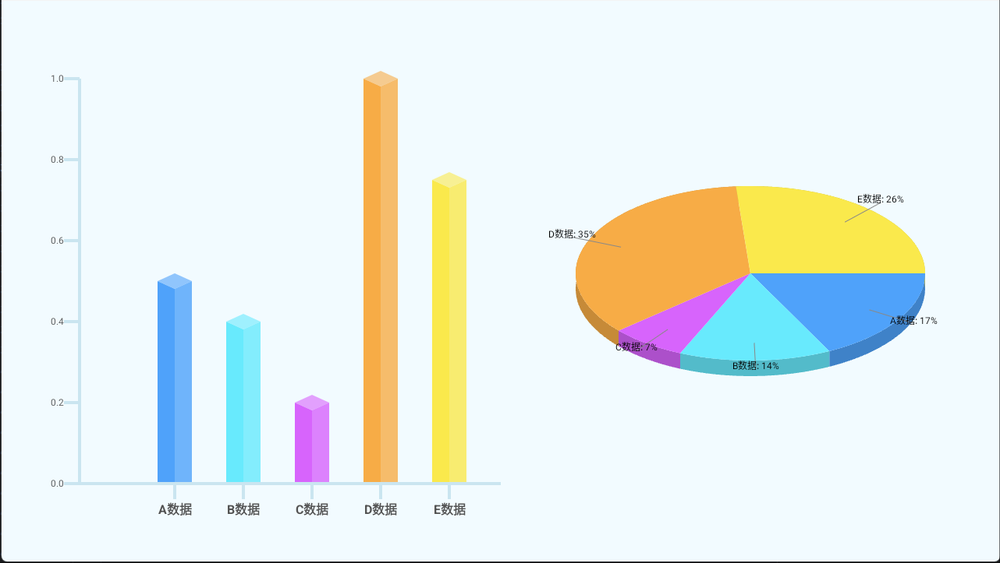

# compose-3d-chart —— 使用 Jetpack Compose 实现的 3D 柱状图与饼状图组件

本项目基于 Jetpack Compose 实现了具有 3D 视觉效果的柱状图和饼状图组件。适用于 Android 应用中数据可视化场景，简单易用且高度可定制。

## 📷 预览效果



## 🚀 快速开始

### 安装依赖

在你的 `build.gradle.kts` 中添加：

```kotlin
dependencies {
    implementation("com.github.yhongm:3dChartForCompose:1.0.0")
}
```

### 使用示例

#### 1. 3D 柱状图

```kotlin
ThreeDBarChart(
    modifier = Modifier.width(400.dp).height(400.dp),
    bars = bars,
    maxHeightRatio = 1f,
)
```

#### 2. 3D 饼状图

```kotlin
ThreeDPieChart(
    modifier = Modifier.width(400.dp).height(400.dp),
    pies = bars,
)
```

> `bars` 是一个包含数据对象的列表，格式为 `List<BarData>`，其中 `BarData` 包含名称和数值。

## 🛠️ 技术亮点

- 使用 Jetpack Compose 构建 UI，支持现代声明式编程风格。
- 自定义 Canvas 绘制实现 3D 视觉效果，性能优异。
- 可轻松扩展为其他图表类型（如雷达图、折线图等）。

## 📚 API 文档

| 参数 | 类型 | 描述 |
|------|------|------|
| `modifier` | `Modifier` | 设置组件宽高及其他样式 |
| `bars` / `pies` | `List<BarData>` | 数据源，包含名称和数值 |
| `maxHeightRatio` | `Float` | 控制柱状图最大高度比例 |

## 🤝 贡献指南

欢迎提交 Issue 或 Pull Request！请先阅读 [CONTRIBUTING.md](CONTRIBUTING.md) 获取更多详情。

## 📄 许可证

该项目采用 [MIT License](LICENSE) 开源协议。